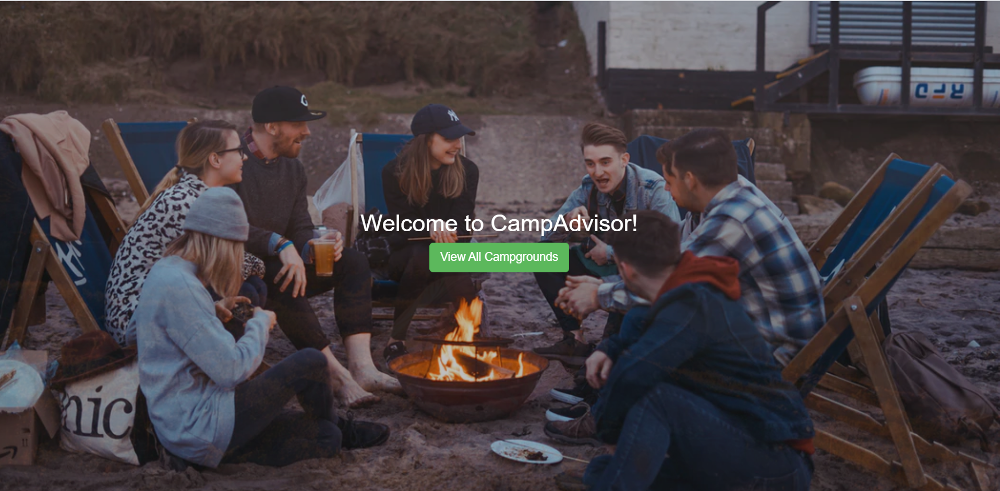
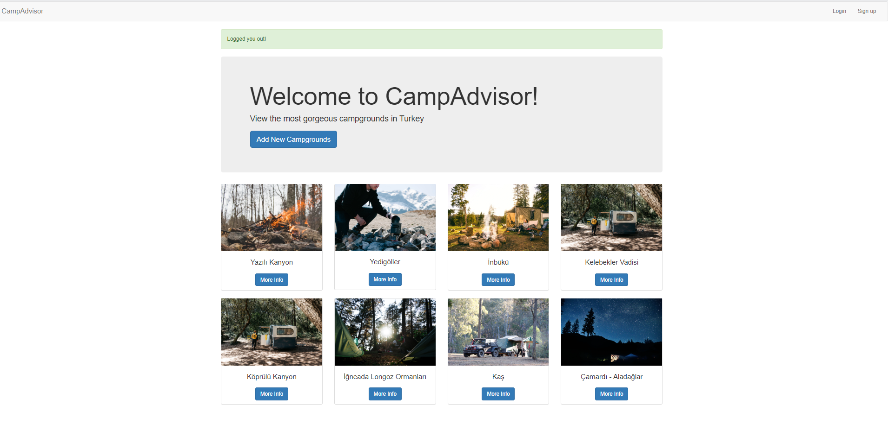
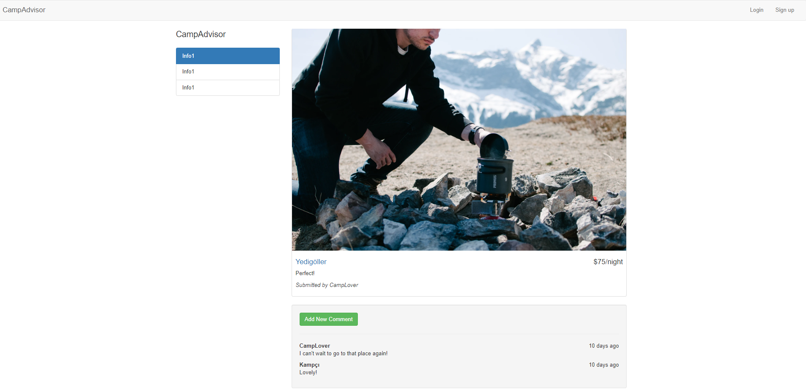

<h1> CampAdvisor Application Project </h1> 

 CampAdvisor is a yelp-like application where users having an account can create and review camp grounds.This project aims to apply certain web development technologies:

<ul> 
<li> HTML 5</li>
<li> CSS3</li>
<li> Bootstrap 4</li> 
<li> JavaScript</li> 
<li> DOM MAnipulation</li>  
<li> NodeJs</li>  
<li> NPM</li>  
<li> ExpressJS</li>  
<li> REST</li>  
<li> MongoDB</li>  
<li> Authentication</li>  
<li> PassportJS</li>  
<li> Authorization</li>  
</ul>

<a href="https://secure-reef-59695.herokuapp.com/" ><strong>Go to CampAdvisor</strong></a>

<h3> Landing Page </h3>

<h3> Index Page </h3>

<h3> Show Page </h3>

