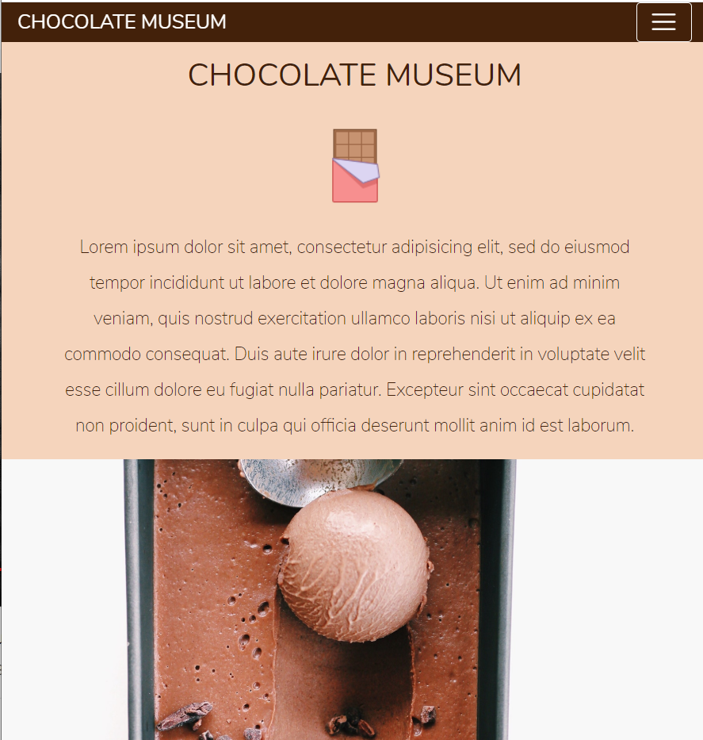

<h1> Chocolate Museum </h1>

It is a web page, prepared to train Bootstrap skills. The page can change the layout based on the detected screen size of your device. Here how it looks like:

   

   

   

