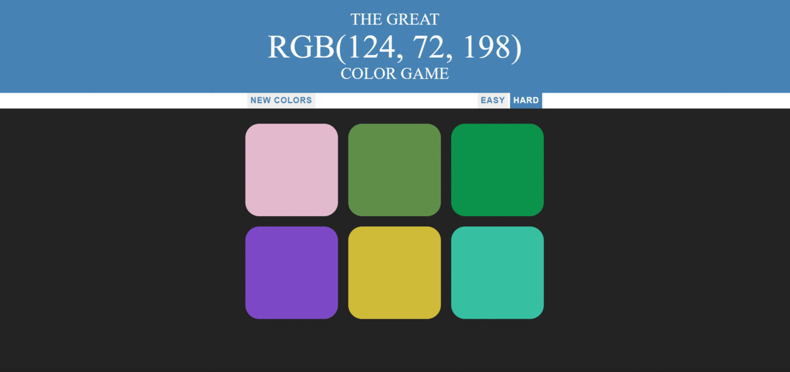

<h1> Color Game </h1>

It is a fun game which test your rgb skills. JQuery is practiced for this game and it is based on estimation of a color for a given rgb value. There is easy and hard options. <em>Have fun!</em>

Concepts Used: [HTML] divs and spans, buttons; [CSS] specificity, transitions, displays (inline-block, none, block); [JS] object listeners, style manipulation, array manipulation, ternary operator, selectors

   

   