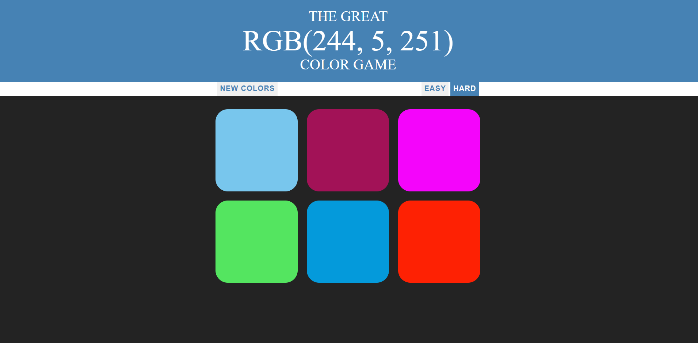
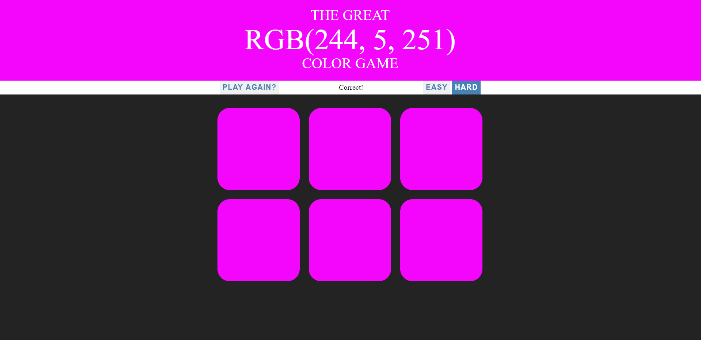

<h1> Color Game </h1>

It is a fun game which test your rgb skills. JQuery is practiced for this game and it is based on estimation of a color for a given rgb value. There is easy and hard options. <strong>Have fun!</strong>

   

   

